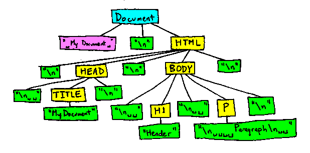

## Traversal

Die DOM-API liefert zu den einzelnen Knotentypen im Baum Schnittstellen. Dabei ist jedoch
zu beachten, dass der der Knoten-Baum auch die Textknoten und Whitespace enthält.

Daher unterscheide ich die Traversal-Methoden und Properties in zwei Gruppen:

### Knoten-Traversierung

Node-API: https://developer.mozilla.org/en-US/docs/Web/API/Node

* elt.parentNode
* elt.firstChild
* elt.lastChild
* elt.childNodes
* elt.previousSibling
* elt.nextSibling

### Element-Traversierung

Node-API: https://developer.mozilla.org/en-US/docs/Web/API/Node

* elt.parentElement

ParentNode-API: https://developer.mozilla.org/en-US/docs/Web/API/ParentNode

* elt.firstElementChild
* elt.lastElementChild
* elt.children, elt.children[ix], elt.children.length

Non-DocumentElement-API: https://developer.mozilla.org/en-US/docs/Web/API/NonDocumentTypeChildNode

* elt.previousElementSilbling, ...

### Traversierung mit jQuery

* http://api.jquery.com/category/traversing/tree-traversal/

